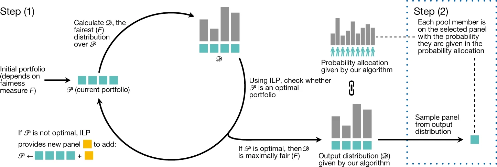

```{r}
#| label: load-packages
#| include: false
library(knitr)
library(ggplot2)
library(dplyr)
library(readr)
library(tidyr)
library(UpSetR)
library(here)
library(tidyverse)
require(ggmosaic)
library(patchwork)
options(width = 70)
```

# Are you in the room?

## Sortition and representation

- Used since ancient times, but recently gaining renewed interest
- Descriptively representative
- Enables greater diversity, inclusion and representation of communities


## Current practice

```{r}
#| echo: false

# Data building

# Set seed
set.seed(13)  # for reproducibility

## Exact counts
age <- c(
  rep("18-29", 250),
  rep("30-44", 300),
  rep("45-64", 250),
  rep("65+", 200)
)

gender <- c(
  rep("Male", 480),
  rep("Female", 480),
  rep("Non-binary", 40)
)

# Shuffle to mix values
age <- sample(age)
gender <- sample(gender)

# Combine and add pool_member_id for Panelot functionality
pop_data <- data.frame(Age = age, Gender = gender)
pop_data$pool_member_identifier <- 1:nrow(pop_data)
pop_data <- pop_data[, c("pool_member_identifier", "Age", "Gender")]
```

```{r}
p1 <- ggplot(pop_data, aes(x = "", fill = Age)) +
  geom_bar(width = 1) +
  coord_polar(theta = "y") +
  labs(title = "Age Distribution of Population") +
  theme_void() +
  scale_fill_manual(values = c("lightblue", "lightgreen", "lightpink", "lightyellow"))
p2 <- ggplot(pop_data, aes(x = "", fill = Gender)) +
  geom_bar(width = 1) +
  coord_polar(theta = "y") +
  labs(title = "Gender Distribution of Population") +
  theme_void() +
  scale_fill_manual(values = c("lightpink", "lightblue", "purple"))
```

```{r}
# Simulating survey

set.seed(13)

response_table <- expand.grid(
  Age = c("18-29", "30-44", "45-64", "65+"),
  Gender = c("Male", "Female", "Non-binary")
)

response_table$response_prob <- c(0.3, 0.3, 0.3, 0.3, 0.3, 0.3, 0.3, 0.3, 0.3, 0.3, 0.3, 0.3)

sur_data <- pop_data %>%
  left_join(response_table, by = c("Age", "Gender")) %>%
  mutate(
    Responded = ifelse(rbinom(n(), 1, response_prob) == 1, "Yes", "No")
  )

# Filter for selected
sur_select <- sur_data %>%
  filter(Responded == "Yes")
```

```{r}
#| echo: false
#| include: false


# Generate quota CSV

quota_df <- data.frame(
  category = c(rep("Age", 4), rep("Gender", 3)),
  name     = c("18-29", "30-44", "45-64", "65+", "Male", "Female", "Non-binary"),
  min      = c(7, 9, 8, 6, 14, 14, 2),
  max      = c(7, 9, 8, 6, 14, 14, 2)
)

quota_df

# Output quota CSV

write_csv(quota_df, here("data/categories.csv"))

# Output survey selected CSV

write_csv(sur_select, here("data/pool.csv"))
```

```{r}
#|echo: false
#|include: false

# Selected panel members (lottery with seed 13)

panel_ids <- c(33, 34,	234, 235,	340,	349,	351,	407,	410,	424,	426,	440,	470,	488,	514,	515,	602,	615,	643,	684,	689,	742,	755,	840,	847,	913,	939,	957,	958,	980)

panel_ids2 <- c(8,	94,	115,	117,	120,	196,	213,	358,	404,	431,	451,	466,	555,	568,	621,	659,	677,	701,	713,	792,	802,	840,	861,	883,	943,	948,	949,	958,	970,	974)

# Filter for selected panel members

pan_select <- sur_select %>%
  filter(pool_member_identifier %in% panel_ids)

pan_select2 <- sur_select %>%
  filter(pool_member_identifier %in% panel_ids2)
```

```{r}
#| label: pan-pie
#| fig-width: 8
#| fig-height: 4
#| out-width: 100%
p3 <- ggplot(pan_select, aes(x = "", fill = Age)) +
  geom_bar(width = 1) +
  coord_polar(theta = "y") +
  labs(title = "Age Distribution of Panel") +
  theme_void() +
  scale_fill_manual(values = c("lightblue", "lightgreen", "lightpink", "lightyellow"))
p4 <- ggplot(pan_select, aes(x = "", fill = Gender)) +
  geom_bar(width = 1) +
  coord_polar(theta = "y") +
  labs(title = "Gender Distribution of Panel") +
  theme_void() +
  scale_fill_manual(values = c("lightpink", "lightblue", "purple"))

((p1 + plot_spacer() + p2) + plot_layout(widths = c(4, 0.1, 4))) /
((p3 + plot_spacer() + p4) + plot_layout(widths = c(4, 0.1, 4)))
```


## The process

- Define a population and traits of interest
- Request expressions of interest from a random subset of the population
- Feed respondents into the sortition algorithm
- Use the generated panel for deliberation and decision-making

## The algorithm (LexiMin) {.small-text}



Step (1): construct a maximally fair output distribution 𝒟 over an optimal portfolio 𝒫 of quota-compliant panels (denoted by coloured boxes), which is done by iteratively building an optimal portfolio of panels and computing the fairest distribution over that portfolio. Step (2): sample the distribution to select a final panel.

# But where in the process do we assess the representativeness?

## Revisiting current practice

```{r}
#| fig-width: 8
#| fig-height: 4
#| out-width: 100%

((p1 + plot_spacer() + p2) + plot_layout(widths = c(4, 0.1, 4))) /
((p3 + plot_spacer() + p4) + plot_layout(widths = c(4, 0.1, 4)))
```

## A better way (representing the population)

:::: {.columns}

::: {.column width="50%"}

```{r}
#| fig-cap: "Every combination of age and gender is present in similar proportions."
#| fig-pos: "H"
#| fig-width: 5
#| fig-asp: 0.825


ggplot(data = pop_data) +
  geom_mosaic(aes(x = product(Gender, Age), fill = Gender)) +
  labs(x = "Age Group",
        y = "Gender") +
  theme_minimal() +
  scale_fill_manual(values = c("pink", "lightblue", "purple"))
```

:::

::: {.column width="50%"}

```{r}
# Prep UpSet Plot Data

upset_pop_data <- pop_data %>%
  mutate(
    `18-29` = as.integer(Age == "18-29"),
    `30-44` = as.integer(Age == "30-44"),
    `45-64` = as.integer(Age == "45-64"),
    `65+`   = as.integer(Age == "65+"),
    Male    = as.integer(Gender == "Male"),
    Female  = as.integer(Gender == "Female"),
    `Non-binary` = as.integer(Gender == "Non-binary")
  )
```

```{r}
#| fig-cap: "All intersections are present. The largest groups are 30-44 and female, followed by 30-44 and male. The smallest group is non-binary over 65."
#| fig-pos: "H"
#| fig-width: 5
#| fig-asp: 0.825

upset(
  upset_pop_data,
  sets = c("18-29", "30-44", "45-64", "65+", "Male", "Female", "Non-binary"),
  keep.order = TRUE,
  mainbar.y.label = "Number of pool members",
  sets.x.label = "Set size"
)
```

:::

::::

## What our panel actually looks like

:::: {.columns}

::: {.column width="50%"}

```{r}
#| fig-cap: "Seven intersections are now not present, and the distribution has shifted significantly from the population and survey sample datasets."
#| fig-pos: "H"
#| fig-width: 5
#| fig-asp: 0.825

ggplot(data = pan_select) +
  geom_mosaic(aes(x = product(Gender, Age), fill = Gender)) +
  labs(x = "Age Group",
        y = "Gender") +
  theme_minimal() +
  scale_fill_manual(values = c("pink", "lightblue", "purple"))
```

:::

::: {.column width="50%"}

```{r}
# Prep UpSet Plot data

upset_pan_data <- pan_select %>%
  mutate(
    `18-29` = as.integer(Age == "18-29"),
    `30-44` = as.integer(Age == "30-44"),
    `45-64` = as.integer(Age == "45-64"),
    `65+`   = as.integer(Age == "65+"),
    Male    = as.integer(Gender == "Male"),
    Female  = as.integer(Gender == "Female"),
    `Non-binary` = as.integer(Gender == "Non-binary")
  )
```

```{r}
#| fig-cap: "Level of representation has significantly decreased, with a number of intersections, including 30-44 and male, now missing."
#| fig-pos: "H"
#| fig-width: 5
#| fig-asp: 0.825

upset(
  upset_pan_data,
  sets = c("18-29", "30-44", "45-64", "65+", "Male", "Female", "Non-binary"),
  keep.order = TRUE,
  mainbar.y.label = "Number of panel members",
  sets.x.label = "Set size")
```

:::

::::

## What's the goal?
<br>
<u>**Improve the process by:**</u>
<br> <br>

1. Demonstrating how LexiMin operates
2. Measuring the level of representation it achieves
3. Investigating where and how it falls short
4. Building a tool to diagnose this more actively in practice

## How will we achieve this?

- Simulate a population and traits of interest
- Simulate the process of requesting expressions of interest and selection
- Visualise the results and build a dashboard to evaluate representativeness

## Specific tests

- Populations (N) of size 100000
- Population subsets (contact rates) of 10%, 30% and 50%
- Panel sizes (k) of 30 and 50
- Traits of interest (m) of 3 and 5
- Population distributions of Uniform, Gaussian, and Beta
- Uniform and varied response rates of 1%, 3%, and 5%
- Extreme cases where one or more groups are particularly small or large

## Reproducibility and Software

Code and data for presentation available at <https://github.com/Pian0Dan/Proposal-Presentation>. Slides produced using [Quarto](https://quarto.org/), with the packages:

::: {style="font-size: 75%;"}

- tidyr [@R-tidyr] 

- dplyr [@R-dplyr] 

- here [@R-here] 

- readr [@R-readr]

- ggplot2 [@R-ggplot2]

- patchwork [@R-patchwork] 

- ggmosaic [@R-ggmosaic]

- UpSetR [@R-UpSetR]

:::

# Let's make sure we're all in the room.

## References {style="font-size: 65%;"}
