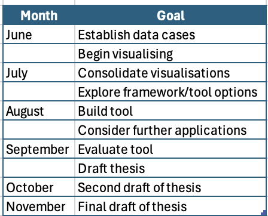

\clearpage
\pagenumbering{arabic}

# \huge Are current sortition methods creating representative panels? A framework analysis {.unnumbered}

Author: Daniel Leo Loza (B.Bus, AMusA)

\vspace{-10pt}

SID: 33842388

\vspace{-10pt}

Supervisors: Dr. Jessica Leung, Prof. Dianne Cook


```{r}
#| label: load_packages
#| include: false
library(dplyr)
library(ggplot2)
library(readr)
library(tidyr)
library(tsibble)
library(feasts)
library(fable)
library(UpSetR)
library(here)
library(tidyverse)
library(devtools)
require(ggmosaic)
library(patchwork)
```

# Introduction

## Topic

This thesis aims to evaluate whether current sortition methods and ideologies lead to actually representative panels in practice. Through simulation and visualisation of algorithm performance, we will examine whether current tools are producing panels that are representative, and offer a way to implement this in practice.

## Background and Motivation

In a social landscape where the public is growing progressively disillusioned with its representation in politics [@landemoreOpinionNoShy2026], it is important to consider ways in which we can foster more inclusive decision-making practices. One way of achieving this, adopted recently by an increasing number of institutions, including the Parisian [@ParisCreatesPermanent], Irish [@walshDissatisfiedEngagedCitizen2021], and British Columbian [@wardExperimentPoliticalCommunication2008] governments, is using sortition to create panels that are more representative of the population for political discussions and deliberations. As a result, the need for fair and representative methods of building panels is only growing, and progress is being made in the structure of selective algorithms. However, there are still many challenges to overcome in order to ensure that these panels consistently achieve the level of representation that they set out to.

Sortition is a method of selection that uses random sampling to create panels that should be descriptively representative of a population. It has been used in various contexts, reaching as far back as ancient Athens (where it was how jurors were selected), and now into modern times for citizens' assemblies, as mentioned prior. The idea is that by randomly selecting individuals from the population, we can create panels that are more representative and inclusive than those selected through traditional methods, like elections or open-ended surveys. Sortition also reduces dominance by elites or highly engaged groups, enabling broader participation across social classes [@Giuliani2025SortitionIP], making it more likely that decisions are in the relevant population's best interest.

One of the main roadblocks in sortition is ensuring that the selection process is transparent and fair, and that the panels are truly representative of the population in terms of demographics and perspectives. But this raises the questions of what it means to be fair, what it means to be representative, and how these look from a systematic perspective.

As a process, sortition can be broken down into four stages: 1) defining the population and traits of interest, 2) surveying a random subset of the population, 3) selecting the panel from respondents, and 4) evaluation of the panel and deliberation. Each of these steps presents an opportunity for bias to be introduced, and for the panel to become less representative of the population. This makes it crucial to evaluate how the level of representativeness (or _potential_ representativeness) flows through each stage, and to understand how different factors may affect it.

Sortition methods have been evolving over time. Prior to algorithmic means, panel selection was carried out through simple self-selection (response to survey/advertising) and proportional sampling to meet panel size requirements. As sortition began to grow more robust, the Legacy [@Flanigan2021FairAF] techniques started surfacing---these saw panels put together through simple choosing of respondents who met the most required "category" condition at any given moment, and would continue iterating until the required marginal counts were present in the selected panel. This led to situations of extreme selection likelihoods, if minorities existed---as members were selected indiscriminately of implied likelihood, meaning there were situations where an individual would potentially be selected 0% of the time. To counteract this, the more systematic algorithm "MaxiMin" was developed [@baharavFairManipulationRobustTransparent2024]; seeking not only to meet panel quotas, but to raise the lowest individual's selection likelihood, to eliminate the 0% selection case, in order to improve representativeness. This, however, now presented the risk of likelihood manipulation, as selection was based more directly on the combination of all category responses given by an individual, rather than pure counts needed for the panel to be filled. As a result, the inverse function "MiniMax" was employed to reduce extreme cases on the other end---eliminating the 100% selection chance case by minimising maximal selection likelihood of any given individual, providing an approach that was more resistant and robust to coercion, but simultaneously reintroducing the potential 0% likelihood problem. Though robustness itself lies beyond the scope of this paper's aims, it is important to note the existence of MiniMax as an approach to the sortition problem, as it impacted further algorithmic development, and robustness as a goal presents an opportunity for further investigation.

More recently, and of direct relevance to the current study, further iterations of MiniMax and MaxiMin, in the forms of "LexiMin" [@Flanigan2021FairAF] and "Goldilocks" [@baharavFairManipulationRobustTransparent2024], were established. These present more generally practical outcomes, with the former being used in industry at present. LexiMin takes the idea of MaxiMin and repeats it for every individual sequentially, maximising _all_ individuals' likelihoods, rather than just those who sit at the absolute bottom. Thus, raising the selection likelihood floor for the participant pool overall. It is, however, like MaxiMin, vulnerable to manipulation (which remains beyond the scope of this paper)---leading into the Goldilocks algorithm solution. Goldilocks aims to simultaneously raise the selection likelihood floor (eliminating the 0% selection chance and improving representativeness), as well as lower the ceiling (eliminating the 100% selection case and making the process more robust against manipulation).

However, there is limited literature on what the outputs of these look like. Additionally, it appears that none of these directly address or validate the presence of any particular intersections within the panels they produce, which presents a risk for insufficient representation.

# Research Design

This study hopes to develop visual tools to understand the LexiMin algorithm in order to:

1. Demonstrate how it operates
2. Measure the level of representation it achieves
3. Investigate where and how it falls short

There has been little done to showcase what this algorithm actually looks like, which limits transparency and interpretability of the process. Additionally, we hope to assess the difference in effectiveness and performance across different sample sizes, population distributions, and extreme cases, as real-world communities can be complex, and optimal sortition should be able to capture this confidently. Within this, we also hope to observe the nature of intersections captured by the algorithm and how these are affected when certain trait groups are particularly small or large, or when response rates differ across groups. With these insights, we will then hope to establish a dashboard that will help guide quota constraint choices and strengthen representativeness.

## Methodology

As the main focus of this paper is visualising algorithmic performance, we will follow a simulation study method to have full control over the data used. The study will construct an example "population", with a set number of traits of interest, for which we will create a set number of observations for each possible response type (e.g. a number of males, a number of females and a number of non-binary people for the gender trait, and so on for other traits). These will then be shuffled and combined to form the individual observations within the simulated population. From this, a "survey sample" will be selected at random with varying and adjustable assumed response rates. This sample will then be fed into the publicly accessible Panelot sortition interface (based on @Flanigan2021FairAF LexiMin) to run selection lottery, where a specific panel will be selected with a set seed for reproducibility, then pulled back for comparison against the distributions at previous steps. The outputs of each step will be visualised with mosaic plots [@jeppsonGeneralizedMosaicPlots2023] and UpSet plots [@UpSetR] to show the distribution of traits and intersections at each stage, as well as pie charts to show the marginal distributions of traits and how these would be superficially compared in practice.

Our specific test cases will be:

- Populations (N) of size 1000, 5000, 10000, and 50000

- Traits of interest (k) of 3 and 5, as these are common in practice

- Population distributions of Uniform, Gaussian, and Beta, to show how the algorithm performs with different levels of skew and complexity

- Uniform and variable response rates of 10%, 30%, and 50%, to show how the algorithm performs when different groups are more or less likely to respond

- Extreme cases where one or more groups are particularly small (e.g. 1% of the population) or large (e.g. 80% of the population), to show how the algorithm performs when certain groups are more or less likely to be represented

After visualising the outputs of the algorithm across these different scenarios, we will then attempt to build a tool designed to allow users to input their population and survey sample data, alongside their Panelot-generated lottery output and a specific seed, then visualise the distribution of traits and intersections in the selected panel against the population, to make it easier to assess representative performance across panel selections.

## Expected results

As the algorithms are not defined to inspect presence of particular intersections, it is expected that there will be no way to ensure a certain "type" of person (beyond defined marginal categories) will be present within the selected panel. As such, it is expected that there will be some extreme case panel iterations with entirely missing population-observed intersections.

## Small test case

To demonstrate the visualisation process and the necessity of this study, we will create a small test case with a population of 1000 individuals, with two traits of interest: age and gender. The age groups will be 18-29, 30-44, 45-64, and 65+, with proportions of 25%, 30%, 25%, and 20% respectively. The gender groups will be 48% male, 48% female, and 4% non-binary. We will follow the methodology outlined above to simulate the population, survey sample (foregoing subsetting of population, to keep the test small), and selected panel, with an assumed response rate of 30% across all groups (for simplicity), and a selected panel size of 30. These will then be visualised.

```{r}
#|echo: false
#|include: false
#|eval: false

# Data building

# Set seed
set.seed(13)  # for reproducibility

## Exact counts
age <- c(
  rep("18-29", 250),
  rep("30-44", 300),
  rep("45-64", 250),
  rep("65+", 200)
)

gender <- c(
  rep("Male", 480),
  rep("Female", 480),
  rep("Non-binary", 40)
)

# Shuffle to mix values
age <- sample(age)
gender <- sample(gender)

# Combine and add pool_member_id for Panelot functionality
pop_data <- data.frame(Age = age, Gender = gender)
pop_data$pool_member_identifier <- 1:nrow(pop_data)
pop_data <- pop_data[, c("pool_member_identifier", "Age", "Gender")]
```

### Visualising population

#### Demographic Summary (Pie Charts)

```{r}
p1 <- ggplot(pop_data, aes(x = "", fill = Age)) +
  geom_bar(width = 1) +
  coord_polar(theta = "y") +
  labs(title = "Age Distribution of Population") +
  theme_void() +
  scale_fill_manual(values = c("lightblue", "lightgreen", "lightpink", "lightyellow"))
```

```{r}
p2 <- ggplot(pop_data, aes(x = "", fill = gender)) +
  geom_bar(width = 1) +
  coord_polar(theta = "y") +
  labs(title = "Gender Distribution of Population") +
  theme_void() +
  scale_fill_manual(values = c("lightpink", "lightblue", "purple"))
```

```{r}
#| label: fig-pop-gen-age-pie
#| fig-cap: "Distributions of age groups and genders in the simulated population dataset, shown as pie charts. Colour corresponds to the category, and size of the slice corresponds to the proportion of the population within that category. All marginal groups are represented."
#| fig-pos: "H"
#| fig-width: 6
#| fig-asp: 0.7

p1 + p2
```

Industry practitioners often use pie charts to visualise the distribution of traits in the population, as they are simple and easy to understand. @fig-pop-gen-age-pie show the distribution of age groups and genders in the simulated population dataset, respectively, as they would be shown to explain the population to a client or stakeholder.

#### Build Mosaic Plot

```{r}
#| label: fig-pop-mos
#| fig-cap: "Relationship between age and gender in the population shown as a mosaic plot. Colour indicates gender. Width of the bars correspond to the count within the category. Every combination contains observations."
#| fig-pos: "H"
#| fig-width: 4
#| fig-asp: 0.825


ggplot(data = pop_data) +
  geom_mosaic(aes(x = product(Gender, Age), fill = Gender)) +
  labs(title = "Age vs Gender Distribution of Population",
        x = "Age Group",
        y = "Gender") +
  theme_minimal() +
  scale_fill_manual(values = c("pink", "lightblue", "purple"))
```

@fig-pop-mos shows the mosaic plot of the population dataset, which demonstrates the distribution of age groups across gender. The plot shows that the simulated population has more younger men than women, on average. It also shows that 12 intersections exist, connecting all traits from each category.

#### Build UpSet Plot
```{r}
# Prep UpSet Plot Data

upset_pop_data <- pop_data %>%
  mutate(
    `18-29` = as.integer(Age == "18-29"),
    `30-44` = as.integer(Age == "30-44"),
    `45-64` = as.integer(Age == "45-64"),
    `65+`   = as.integer(Age == "65+"),
    Male    = as.integer(Gender == "Male"),
    Female  = as.integer(Gender == "Female"),
    `Non-binary` = as.integer(Gender == "Non-binary")
  )
```

```{r}
#| label: fig-pop-ups
#| fig-cap: "Relationship between age and gender in the population shown as an UpSet plot. Bar heights indicate the number of observations within each intersection. All intersections are present, with the largest being between the 30-44 age group and the female gender, followed by 30-44 and male."
#| fig-pos: "H"
#| fig-width: 4
#| fig-asp: 0.825

upset(
  upset_pop_data,
  sets = c("18-29", "30-44", "45-64", "65+", "Male", "Female", "Non-binary"),
  keep.order = TRUE,
  mainbar.y.label = "Number of pool members",
  sets.x.label = "Set size"
)
```

@fig-pop-ups shows the UpSet plot of the population dataset, which demonstrates the counts of intersections of age groups across gender. The plot shows that the largest intersection is between the 30-44 age group and the female gender, followed by males for the same age group, so it would be hoped that these intersection would be well-represented in the selected panel.

### Visualising survey sample

```{r}
# Simulating survey

set.seed(13)

response_table <- expand.grid(
  Age = c("18-29", "30-44", "45-64", "65+"),
  Gender = c("Male", "Female", "Non-binary")
)

response_table$response_prob <- c(0.3, 0.3, 0.3, 0.3, 0.3, 0.3, 0.3, 0.3, 0.3, 0.3, 0.3, 0.3)

sur_data <- pop_data %>%
  left_join(response_table, by = c("Age", "Gender")) %>%
  mutate(
    Responded = ifelse(rbinom(n(), 1, response_prob) == 1, "Yes", "No")
  )

# Filter for selected
sur_select <- sur_data %>%
  filter(Responded == "Yes")
```

#### Mosaic plot

```{r}
#| label: fig-sur-mos
#| fig-cap: "Relationship between age and gender in the survey sample shown as a mosaic plot. Colour indicates gender. Width of the bars correspond to the count within the category. All intersections still present, though the distribution has shifted, with some groups being more or less represented than before."
#| fig-pos: "H"
#| fig-width: 4
#| fig-asp: 0.825

ggplot(data = sur_select) +
  geom_mosaic(aes(x = product(Gender, Age), fill = Gender)) +
  labs(title = "Age vs Gender Distribution of Survey Sample",
        x = "Age Group",
        y = "Gender") +
  theme_minimal() +
  scale_fill_manual(values = c("pink", "lightblue", "purple"))
```

@fig-sur-mos shows the mosaic plot of the survey sample dataset, which demonstrates the distribution of age groups across gender in the simulated survey sample. The plot shows that the distribution has changed from the population dataset, with some groups being more or less represented than before. For example, the genders among ages are now less balanced across all age groups.

#### Make UpSet Plot

```{r}
# Prep UpSet plot data

upset_sur_data <- sur_select %>%
  mutate(
    `18-29` = as.integer(Age == "18-29"),
    `30-44` = as.integer(Age == "30-44"),
    `45-64` = as.integer(Age == "45-64"),
    `65+`   = as.integer(Age == "65+"),
    Male    = as.integer(Gender == "Male"),
    Female  = as.integer(Gender == "Female"),
    `Non-binary` = as.integer(Gender == "Non-binary")
  )
```

@fig-sur-ups shows the UpSet plot of the survey sample dataset, which demonstrates the counts of intersections of age groups across gender in the simulated survey sample. The plot shows that the largest intersection is still between the 30-44 age group and the female gender.

```{r}
#| label: fig-sur-ups
#| fig-cap: "Relationship between age and gender in the survey sample shown as an UpSet plot. Bar heights indicate the number of observations within each intersection. All intersections are still present, though the distribution has shifted, though the intersections between the 30-44 age group and male and female genders remain among the largest."
#| fig-pos: "H"
#| fig-width: 4
#| fig-asp: 0.825

upset(
  upset_sur_data,
  sets = c("18-29", "30-44", "45-64", "65+", "Male", "Female", "Non-binary"),
  keep.order = TRUE,
  mainbar.y.label = "Number of pool members",
  sets.x.label = "Set size"
)
```

```{r}
#| echo: false
#| include: false


# Generate quota CSV

quota_df <- data.frame(
  category = c(rep("Age", 4), rep("Gender", 3)),
  name     = c("18-29", "30-44", "45-64", "65+", "Male", "Female", "Non-binary"),
  min      = c(7, 9, 8, 6, 14, 14, 2),
  max      = c(7, 9, 8, 6, 14, 14, 2)
)

quota_df

# Output quota CSV

write_csv(quota_df, here("data/categories.csv"))

# Output survey selected CSV

write_csv(sur_select, here("data/pool.csv"))
```

```{r}
#|echo: false
#|include: false

# Selected panel members (lottery with seed 13)

panel_ids <- c(33, 34,	234, 235,	340,	349,	351,	407,	410,	424,	426,	440,	470,	488,	514,	515,	602,	615,	643,	684,	689,	742,	755,	840,	847,	913,	939,	957,	958,	980)

panel_ids2 <- c(8,	94,	115,	117,	120,	196,	213,	358,	404,	431,	451,	466,	555,	568,	621,	659,	677,	701,	713,	792,	802,	840,	861,	883,	943,	948,	949,	958,	970,	974)

# Filter for selected panel members

pan_select <- sur_select %>%
  filter(pool_member_identifier %in% panel_ids)

pan_select2 <- sur_select %>%
  filter(pool_member_identifier %in% panel_ids2)
```


### Visualising panel sample

#### Mosaic Plot

```{r}
#| label: fig-pan-mos
#| fig-cap: "Relationship between age and gender in the selected panel shown as a mosaic plot. Colour indicates gender. Width of the bars correspond to the count within the category. Seven intersections are now not present, and the distribution has shifted significantly from the population and survey sample datasets."
#| fig-pos: "H"
#| fig-width: 4
#| fig-asp: 0.825

ggplot(data = pan_select) +
  geom_mosaic(aes(x = product(Gender, Age), fill = Gender)) +
  labs(title = "Age vs Gender Distribution of Selected Panel",
        x = "Age Group",
        y = "Gender") +
  theme_minimal() +
  scale_fill_manual(values = c("pink", "lightblue", "purple"))
```

@fig-pan-mos shows the mosaic plot of the selected panel dataset, which demonstrates the distribution of age groups across gender in the simulated selected panel. By the time we reach this step, we can see that the distribution has changed significantly from the population dataset. In fact, this particular iteration presents an extreme case where all younger panel members are female, all older members are male, and all non-binary members are in the oldest group.

#### UpSet Plot

```{r}
# Prep UpSet Plot data

upset_pan_data <- pan_select %>%
  mutate(
    `18-29` = as.integer(Age == "18-29"),
    `30-44` = as.integer(Age == "30-44"),
    `45-64` = as.integer(Age == "45-64"),
    `65+`   = as.integer(Age == "65+"),
    Male    = as.integer(Gender == "Male"),
    Female  = as.integer(Gender == "Female"),
    `Non-binary` = as.integer(Gender == "Non-binary")
  )
```

```{r}
#| label: fig-pan-ups
#| fig-cap: "Relationship between age and gender in the selected panel shown as an UpSet plot. Bar heights indicate the number of observations within each intersection. Level of representation has significantly decreased, with a number of intersections, including 30-44 and male, now missing."
#| fig-pos: "H"
#| fig-width: 4
#| fig-asp: 0.825

upset(
  upset_pan_data,
  sets = c("18-29", "30-44", "45-64", "65+", "Male", "Female", "Non-binary"),
  keep.order = TRUE,
  mainbar.y.label = "Number of pool members",
  sets.x.label = "Set size")
```

@fig-pan-ups shows the UpSet plot of the selected panel dataset, which demonstrates the counts of intersections of age groups across gender in the simulated selected panel. Echoing the distribution shift shown in the mosaic plot, the UpSet plot shows that a number of intersections are now missing. This was, to some extent, expected for the non-binary group, as only two members of this group were going to be selected regardless, meaning at least two intersections would not be represented. However, the complete absence of all younger male and non-binary members, as well as all older female members is a signifcant deviation from the population and survey sample datasets, and demonstrates the risk of insufficient representation when intersections are not directly addressed by the selection process.

#### Demographic Summary (Pie Charts)

```{r}
p3 <- ggplot(pan_select, aes(x = "", fill = Age)) +
  geom_bar(width = 1) +
  coord_polar(theta = "y") +
  labs(title = "Age Distribution of Population") +
  theme_void() +
  scale_fill_manual(values = c("lightblue", "lightgreen", "lightpink", "lightyellow"))
```

```{r}
p4 <- ggplot(pan_select, aes(x = "", fill = Gender)) +
  geom_bar(width = 1) +
  coord_polar(theta = "y") +
  labs(title = "Gender Distribution of Population") +
  theme_void() +
  scale_fill_manual(values = c("lightpink", "lightblue", "purple"))
```

```{r}
#| label: fig-pan-gen-age-pie
#| fig-cap: "Pie chart showing the distribution of genders in the simulated population dataset"
#| fig-pos: "H"
#| fig-width: 6
#| fig-asp: 0.7

p3 + p4
```

Bringing this back to the pie chart example from earlier, @fig-pan-gen-age-pie are notably almost identical to the population pie charts (with difference as result of rounding), as the marginal distributions of age and gender are the same across the population and selected panel datasets, even though we know the intersectional distributions are not, thanks to the mosaic and UpSet plots.

This example is the crux of why sortition performance must be visually evaluated at the intersectional level, prior to any sort of deliberation or decision-making process, as it can reveal significant representativeness issues that may not be apparent from summary statistics alone, and which may impact the legitimacy and quality of the panel's outcomes. As, despite the fact that the panel seen in this case meets all marginal quotas, it is not representative of the population in a meaningful way, and may not be able to provide the intended benefits of sortition as a result. For this reason, we will be investigating ways to benchmark performance through visualisation, to make sure selected panels are representative before they are used for deliberation.

## Research Plan

